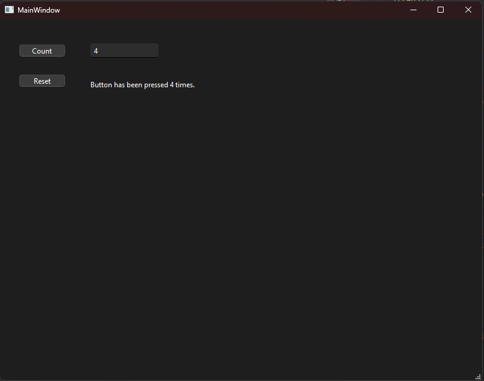

# Week 7

Task can be found [here](https://peatutor.com/cplus/harjoitukset/h7.php).

I did deviate from the original task some what by using custom `counterChanged` signal to update changed counter value to two text based fields instead of changing them directly in button press handlers.

## Example execution

note: Files uploaded via guthub.com UI as done with someone elses computer.
